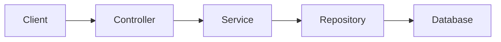
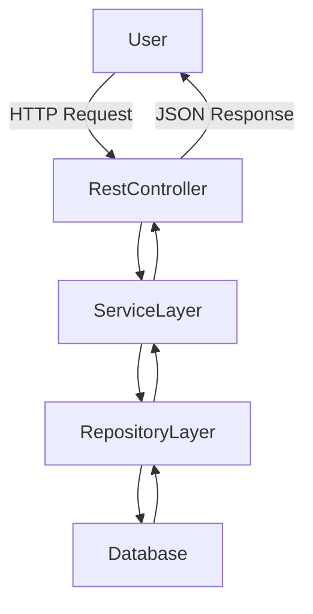

# 🚀 Spring Boot REST API

**GitHub Repository:** [https://github.com/ritanath2k03/SpringBoot](https://github.com/ritanath2k03/SpringBoot)

This project is a **Spring Boot REST API** built using Java and Maven. It demonstrates the standard **RESTful architecture** using Spring Boot with clear separation of concerns via **Controller, Service, and Repository layers**.

---

## 🧩 Project Overview

The application exposes REST endpoints that handle HTTP requests (GET, POST, PUT, DELETE). It follows industry‑standard best practices and can be easily extended with database integration, security, and documentation tools like Swagger.

---

## 🏗️ Architecture

### High‑Level Architecture



### API Controller Flow



---

## 📁 Project Structure

```
SpringBoot
├── src
│   ├── main
│   │   ├── java
│   │   │   └── com.example.springboot
│   │   │       ├── controller   # REST Controllers
│   │   │       ├── service      # Business Logic
│   │   │       ├── repository   # Data Access Layer
│   │   │       └── model        # Entities / DTOs
│   │   └── resources
│   │       └── application.properties
├── pom.xml
└── README.md
```

---

## 📌 REST API Endpoints

| Method | Endpoint       | Description     |
| ------ | -------------- | --------------- |
| GET    | `/api/**`      | Fetch data      |
| POST   | `/api/**`      | Create new data |
| PUT    | `/api/**/{id}` | Update data     |
| DELETE | `/api/**/{id}` | Delete data     |

*(Exact endpoints depend on controller implementation.)*

---

## 🧪 Sample Controller (Illustrative)

```java
@RestController
@RequestMapping("/v1/book")
public class SampleController {

    private final SampleService sampleService;

    public SampleController(SampleService sampleService) {
        this.sampleService = sampleService;
    }

    @GetMapping("/{id}")
    public ResponseEntity<?> getById(@PathVariable Long id) {
        return ResponseEntity.ok(sampleService.getById(id));
    }

    @PostMapping
    public ResponseEntity<?> create(@RequestBody Object request) {
        return ResponseEntity.status(HttpStatus.CREATED)
                             .body(sampleService.create(request));
    }
}
```

---

## ▶️ Running the Application

### Prerequisites

* Java 17+
* Maven

### Steps

```bash
# Clone the repository
git clone https://github.com/ritanath2k03/SpringBoot

# Navigate to project
cd SpringBoot

# Build project
./mvnw clean install

# Run application
./mvnw spring-boot:run
```

Application runs at:

```
http://localhost:8080
```

---

## 📄 Example API Request

**POST** `/api/example`

```json
{
  "name": "Test",
  "value": 123
}
```

**Response**

```json
{
  "id": 1,
  "name": "Test",
  "value": 123
}
```

---

## 📚 Optional Enhancements

* ✅ Swagger documentation
* ✅ Database integration (MySQL)
* ✅ Validation using `@Valid`
* ✅ Global exception handling
* ✅ Spring Security

---

## 🤝 Contributing

Contributions are welcome!

1. Fork the repository
2. Create a new branch
3. Commit your changes
4. Open a Pull Request

---

## 👨‍💻 Author

**Ritanath Malakar**
GitHub: [https://github.com/ritanath2k03](https://github.com/ritanath2k03)

---

⭐ If you find this project useful, don’t forget to star the repository!
